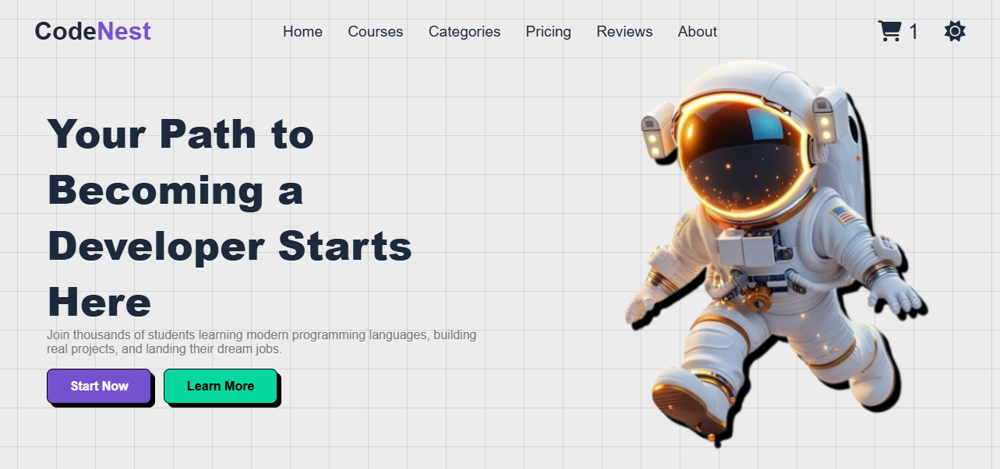
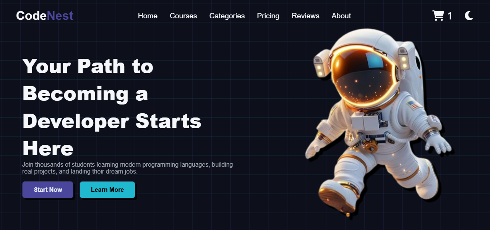

## ✨ CodeNest - Ultimate Learning Platform
A stunning, fully responsive **Online Learning Platform website* built with *HTML5, CSS3, and JavaScript**. This project features a modern educational design with dark/light theme toggle, perfect for coding enthusiasts and learners.

## ✨ Features
- 🎨 **Dual Theme System** with dark/light mode toggle
- 📱 **Fully Responsive** (Desktop, Tablet, Mobile)
- 🖥️ **Fixed Navigation** with smooth scrolling
- ⚡ **Smooth Animations** using AOS (Animate On Scroll)
- 🔥 **Interactive Course Filtering** by programming languages
- 🛒 **Shopping Cart** with persistent counter
- 🎯 **Modern UI Components** (cards, hover effects, grid layouts)
- 📖 **Clean Typography** using Poppins font
- ✨ **Custom CSS Variables** for consistent theming
- 🎪 **Grid Background Animation** for visual appeal

## 🖼️ Demo

🔗 [Live Demo]()  

## 🚀 Technologies Used
- **HTML5** – Semantic structure
- **CSS3** –
 - CSS Variables for theming
 - Grid & Flexbox layouts
 - Custom animations & keyframes
 - Media queries for responsiveness
- **JavaScript (ES6)** –
 - DOM manipulation
 - Hamburger menu functionality
 - Course filtering system
 - Theme switching
 - Shopping cart counter
 - Local storage integration
- **AOS Library** – Scroll animations
- **Font Awesome** – Icons
- **Google Fonts** – Poppins

## 📸 Screenshots

### Desktop View

